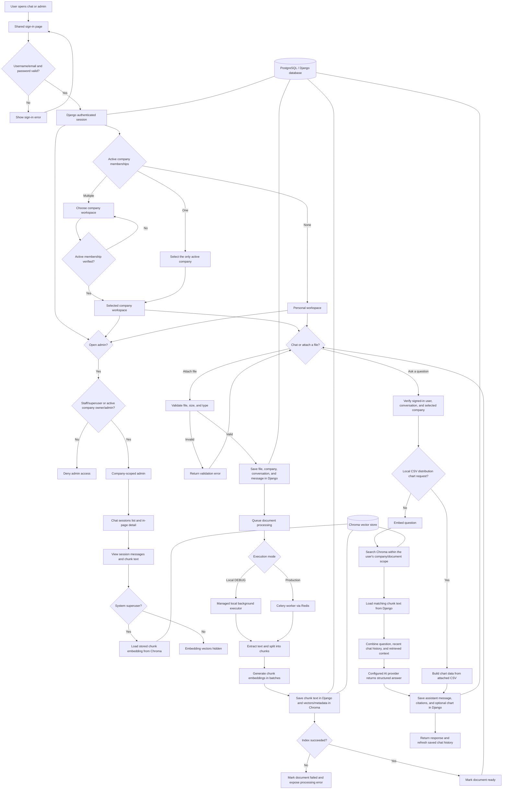

# AI Knowledge & Chat Platform

A Django-based Demo Company for intelligent chat and document processing. Built with a modular architecture that supports multiple AI providers, vector search, async task processing, and observability out of the box.

---

## Architecture Summary

```
┌─────────────────────────────────────────────────────────────────┐
│                        Django Application                        │
│  chat  ·  docs  ·  auth  ·  company  ·  ai  ·  audit             │
│  basics  ·  scrapper  ·  infrastructure                         │
└──────────────────────────────┬──────────────────────────────────┘
                               │
          ┌────────────────────┼────────────────────┐
          ▼                    ▼                    ▼
   ┌─────────────┐    ┌──────────────┐    ┌──────────────────┐
   │  PostgreSQL  │    │    Redis     │    │   Celery Workers  │
   │  (primary   │    │  (cache &    │    │  (document ingest │
   │   database) │    │   broker)    │    │   & async tasks)  │
   └─────────────┘    └──────────────┘    └──────────────────┘
          │                                        │
   ┌──────┴──────┐    ┌──────────────┐    ┌───────┴──────────┐
   │   Temporal  │    │   ChromaDB   │    │      Kafka        │
   │  (workflow  │    │ (vector store│    │  (event streaming)│
   │  orchestr.) │    │  & RAG)      │    │                   │
   └─────────────┘    └──────────────┘    └──────────────────┘
                               │
                      ┌────────┴────────┐
                      │    Langfuse      │
                      │ (LLM observabil.)│
                      └─────────────────┘
```

**Infrastructure services:**

| Service    | Purpose                          | Port  |
|------------|----------------------------------|-------|
| Django     | Web application & REST API       | 8000  |
| PostgreSQL | Primary relational database      | 5432  |
| Redis      | Cache, session store, task broker| 6379  |
| Kafka      | Event streaming (KRaft mode)     | 9092  |
| ChromaDB   | Vector store for RAG             | 8001  |
| Langfuse   | LLM tracing & observability      | 3001  |
| Temporal   | Durable workflow orchestration   | 7233  |
| Temporal UI| Workflow management dashboard    | 8080  |

---

## End-to-end application flow



---

## Quick Start (3 commands)

```bash
make env          # copy .env.example → .env
make migrate      # apply database migrations
make run          # start development server at http://127.0.0.1:8000
```

---

## Full Local Setup (without Docker)

### Prerequisites

- Python 3.10+
- Node.js 22+
- Git

### 1. Clone and create a virtual environment

```bash
git clone <repo-url>
cd django-unfold
python3 -m venv venv
source venv/bin/activate
```

### 2. Install dependencies

```bash
pip install -r requirements/local.txt
cd frontend && npm ci && npm run build && cd ..
```

### 3. Configure environment

```bash
cp .env.example .env
# Edit .env — set DJANGO_SECRET_KEY, OPENAI_API_KEY (embeddings), and the chat provider settings
```

### 4. Run migrations and create a superuser

```bash
python manage.py migrate
python manage.py createsuperuser
```

### 5. Start the development server

```bash
# Document indexing runs asynchronously in the local development server.
python manage.py runserver
```

Uploads are saved immediately and indexed by a managed local background executor, so
Redis and a Celery worker do not need to be started for local development. The chat
shows queued, processing-stage, and progress updates; ask questions about a file
after it reaches Ready. In production, run Redis and the Celery worker as separate
host services. Celery uses four worker processes; embedding requests contain
up to 96 text chunks and run at most four concurrently per document.

Open:
- http://127.0.0.1:8000/ — React chat workspace
- http://127.0.0.1:8000/admin/ — Django Unfold admin

The chat and admin routes share the same sign-in screen and accept either a username or email address. The same Django session is used on both routes. Active company owners and admins can access the admin workspace for their own company; system administrators can access every company.

The main site opens a React-powered ChatGPT-style workspace. Start a chat from the sidebar, browse saved conversations, and use the plus button inside the prompt composer to attach PDF, DOCX, TXT, Markdown, CSV, XLSX, or JSON files. Chats and messages are stored in Django and scoped to the selected company; users with multiple memberships choose a company workspace before chatting. Uploaded files retain their owner, company, conversation, file metadata, processing status, chunk count, and database reference; each attachment appears in its conversation history and the Library. Supported files are extracted, split into overlapping chunks, embedded with OpenAI, and stored in persistent Chroma. In the admin workspace, the Chat sessions view shows sessions on the left and the selected conversation with its indexed chunk text on the right. System administrators can also load stored embedding vectors for individual chunks. Each chunk UUID and source location is stored in Django and returned as a citation. Chat responses use the configured AI provider. When a chart is requested, the chat API returns validated pie, bar, or line chart data grounded in retrieved file passages; the React client renders that API response. Scanned/image-only PDFs, legacy XLS files, and other unsupported formats are rejected.

Set `OPENAI_API_KEY` for document embeddings. By default, chat uses OpenAI with `AI_PROVIDER=openai` and `DEFAULT_LLM_MODEL=gpt-4o-mini`. To use DeepSeek or another OpenAI-compatible chat API, set `AI_PROVIDER=openai_compatible`, `AI_BASE_URL` to that API's `/v1` endpoint, `AI_API_KEY` to its key, and `DEFAULT_LLM_MODEL` to its model identifier. Chat credentials are separate from the OpenAI embedding key; switching chat providers does not require code changes. Extracted text from supported files and chat prompts are sent to the configured provider for answers. Local development stores Chroma data under `chroma_data/`. The admin remains available at `/admin/`.

---

## Docker Compose Setup

Docker support has been removed from this project. Run the application and its
supporting services (PostgreSQL, Redis, ChromaDB, etc.) directly on your host as
described in the local setup sections above.

---

## Environment Variables Reference

Copy `.env.example` to `.env` and override as needed.

| Variable                    | Default                        | Description                                      |
|-----------------------------|--------------------------------|--------------------------------------------------|
| `DJANGO_SECRET_KEY`         | *(required)*                   | Django secret key — use a strong random value    |
| `DJANGO_DEBUG`              | `1`                            | Set to `0` in production                         |
| `DJANGO_ALLOWED_HOSTS`      | `localhost,127.0.0.1,[::1]`    | Comma-separated allowed hosts                    |
| `DJANGO_SETTINGS_MODULE`    | `base.settings.local`           | Settings module to use                           |
| `POSTGRES_DB`               | `aiplatform`                   | PostgreSQL database name                         |
| `POSTGRES_USER`             | `aiplatform`                   | PostgreSQL user                                  |
| `POSTGRES_PASSWORD`         | `aiplatform123`                | PostgreSQL password                              |
| `POSTGRES_HOST`             | `localhost`                    | PostgreSQL host                                  |
| `POSTGRES_PORT`             | `5432`                         | PostgreSQL port                                  |
| `REDIS_URL`                 | `redis://localhost:6379/0`     | Redis connection URL                             |
| `KAFKA_BOOTSTRAP_SERVERS`   | `localhost:9092`               | Kafka broker address                             |
| `TEMPORAL_HOST`             | `localhost:7233`               | Temporal server address                          |
| `CHROMA_HOST`               | *(empty)*                      | Chroma server host; empty uses persistent local Chroma |
| `CHROMA_PORT`               | `8000`                         | Chroma server port                               |
| `CHROMA_PATH`               | `chroma_data`                  | Persistent local vector data directory           |
| `LANGFUSE_HOST`             | `http://localhost:3001`        | Langfuse API base URL                            |
| `LANGFUSE_PUBLIC_KEY`       | *(empty)*                      | Langfuse project public key                      |
| `LANGFUSE_SECRET_KEY`       | *(empty)*                      | Langfuse project secret key                      |
| `LANGFUSE_NEXTAUTH_SECRET`  | `changeme-in-production`       | Langfuse auth secret — **change in production**  |
| `LANGFUSE_SALT`             | `changeme-salt`                | Langfuse password hashing salt                   |
| `AI_PROVIDER`               | `openai`                       | Chat provider: `openai` or `openai_compatible`   |
| `DEFAULT_LLM_MODEL`         | `gpt-4o-mini`                  | Chat model name                                  |
| `AI_API_KEY`                | `OPENAI_API_KEY`               | Chat API key; use the provider-specific key      |
| `AI_BASE_URL`               | *(empty)*                      | Chat API `/v1` base URL for compatible providers|
| `OPENAI_EMBEDDING_MODEL`    | `text-embedding-3-small`       | OpenAI embedding model for document chunks/queries |
| `OPENAI_API_KEY`            | *(required for embeddings)*    | OpenAI key for embeddings; also default chat key|
| `OLLAMA_BASE_URL`           | `http://localhost:11434`       | Ollama base URL for local LLM                    |
| `DOCUMENT_PROCESSING_BACKEND` | `celery`                     | Processing backend: `celery`, `kafka`, `temporal`|
| `CORS_ALLOWED_ORIGINS`      | `http://localhost:3000,...`    | CORS allowed origins (comma-separated)           |
| `MAX_UPLOAD_SIZE_MB`        | `50`                           | Maximum file upload size in MB                   |

---

## API Endpoints Reference

### Chat

| Method | URL             | Description                   |
|--------|-----------------|-------------------------------|
| GET    | `/chat/`        | Chat UI page                  |
| POST   | `/chat/api/`    | Send a message, get an AI reply and PDF citations |
| GET    | `/chat/api/conversations/` | List the signed-in user's conversations |
| GET    | `/chat/api/conversations/<id>/` | Load a conversation, messages, citations, charts, and attached-file metadata |

### Documents

| Method | URL                   | Description              |
|--------|-----------------------|--------------------------|
| GET    | `/documents/`         | List uploaded documents and their processing metadata |
| POST   | `/documents/upload/`  | Upload and index a supported document, linked to a conversation |
| POST   | `/documents/<id>/reprocess/` | Retry indexing a previously saved failed upload |

### Users / Auth

| Method | URL              | Description                         |
|--------|------------------|-------------------------------------|
| POST   | `/api/v1/auth/register/` | Register a new user            |
| POST   | `/api/v1/auth/login/`  | Obtain JWT access & refresh tokens |
| POST   | `/api/v1/auth/logout/` | Invalidate refresh token       |
| GET    | `/api/v1/auth/me/`     | Get current authenticated user info |
| POST   | `/chat/session/login/` | Create the chat page's signed-in session |
| POST   | `/chat/session/logout/` | End the chat page's session |

### Admin

| URL       | Description              |
|-----------|--------------------------|
| `/admin/` | Django Unfold admin panel |

---

## Development Commands (Makefile)

Run `make help` to see all available targets.

```
  help                   Show this help
  install                Install Python dependencies (local)
  migrate                Apply database migrations
  makemigrations         Create new migrations
  run                    Start development server
  shell                  Open Django shell
  createsuperuser        Create admin superuser
  collectstatic          Collect static files
  test                   Run tests
  lint                   Run ruff linter
  format                 Format code
  celery-worker          Start Celery worker (local)
  celery-beat            Start Celery beat scheduler (local)
  env                    Copy .env.example to .env
```

---

## Project Structure

```
django-unfold/
│
├── ai/                            # AI provider abstractions
├── audit/                         # Audit logs
├── auth/                          # Authentication and user model
├── basics/                        # Shared models, middleware, admin
├── chat/                          # Conversations and messaging
├── company/                       # Company tenancy and memberships
├── docs/                          # Document processing and chunks
├── scrapper/                      # Document API and queue integration
│
├── config/                        # Django project configuration
│   └── ...                        # Compatibility imports for base project config
├── base/                          # Active settings, URLs, WSGI, ASGI, Celery
│
├── infrastructure/                # External service integrations
│   ├── celery/                    # Celery app & task routing
│   ├── kafka/                     # Kafka producers & consumers
│   ├── llm/                       # LLM client wrappers
│   ├── redis/                     # Redis client utilities
│   ├── storage/                   # File storage backends
│   ├── temporal/                  # Temporal workflow definitions
│   └── vectorstore/               # ChromaDB / vector store client
│
├── requirements/
│   ├── base.txt                   # Core dependencies
│   └── local.txt                  # Development extras (pytest, ruff, etc.)
│
├── tests/                         # Project-level test suite
│
├── .env.example                   # Environment variable template
├── Makefile                       # Developer convenience commands
└── manage.py                      # Django management entry point
```

---

## Settings Modules

| Module                      | Use case                              |
|-----------------------------|---------------------------------------|
| `base.settings.local`      | Local development (default)           |
| `base.settings.production` | Production deployment (PostgreSQL)    |

Override via environment variable:
```bash
DJANGO_SETTINGS_MODULE=base.settings.production python manage.py runserver
```

---

## PostgreSQL Database

### Where PostgreSQL is used

The database engine is chosen by the active settings module:

| Settings module            | Engine                              | Default name  |
|----------------------------|-------------------------------------|---------------|
| `base.settings.local`      | SQLite (`db.sqlite3` in project root) | `db.sqlite3`  |
| `base.settings.production` | PostgreSQL                          | `aiplatform`  |

PostgreSQL is configured in `base/settings/production.py` and driven entirely
by environment variables (defaults shown):

| Variable            | Default       | Description              |
|---------------------|---------------|--------------------------|
| `POSTGRES_DB`       | `aiplatform`  | Database name            |
| `POSTGRES_USER`     | `aiplatform`  | Database user            |
| `POSTGRES_PASSWORD` | *(empty)*     | Database password        |
| `POSTGRES_HOST`     | `127.0.0.1`   | Database host            |
| `POSTGRES_PORT`     | `5432`        | Database port            |

Django connects with `psycopg` (v3) and keeps connections open for 60 seconds
(`CONN_MAX_AGE = 60`).

### Complete flow (from zero to a running PostgreSQL-backed app)

```bash
# 1. Install and start PostgreSQL on the host, then create the role + database.
#    (run as the postgres superuser; adjust names/passwords as needed)
sudo -u postgres psql <<'SQL'
CREATE USER aiplatform WITH PASSWORD 'aiplatform123';
CREATE DATABASE aiplatform OWNER aiplatform;
GRANT ALL PRIVILEGES ON DATABASE aiplatform TO aiplatform;
SQL

# 2. Point the app at PostgreSQL via environment variables.
export DJANGO_SETTINGS_MODULE=base.settings.production
export POSTGRES_DB=aiplatform
export POSTGRES_USER=aiplatform
export POSTGRES_PASSWORD=aiplatform123
export POSTGRES_HOST=127.0.0.1
export POSTGRES_PORT=5432
export DJANGO_SECRET_KEY='change-me'
export DJANGO_ALLOWED_HOSTS='localhost,127.0.0.1'

# 3. Create all tables (runs every app's migrations against PostgreSQL).
python manage.py migrate

# 4. Create an admin user and (optionally) start the server.
python manage.py createsuperuser
python manage.py runserver
```

How the data flows into these tables at runtime:

1. **Auth** — `createsuperuser` / registration writes to `accounts_user`.
2. **Tenancy** — companies and memberships are stored in `company` and
   `company_membership`; every scoped row carries a `company_id`.
3. **Chat** — a new conversation inserts a row in `chatbot_conversation`; each
   user/assistant turn inserts into `chatbot_message` (charts are stored on the
   message as JSON in `chart_data`); file attachments are linked through the
   `chatbot_message_documents` join table.
4. **Documents** — uploads create a row in `documents_document`; after
   extraction the text chunks are written to `documents_documentchunk`
   (vectors/metadata go to Chroma, not PostgreSQL).
5. **Audit** — significant actions append immutable rows to `audit_logs`.

### Core tables

| Table                       | Model                      | Purpose                                   |
|-----------------------------|----------------------------|-------------------------------------------|
| `accounts_user`             | `auth.User`                | Users (UUID PK, email login)              |
| `company`                   | `company.Company`          | Tenant organisations                      |
| `company_membership`        | `company.CompanyMembership`| User↔company roles (owner/admin/member)   |
| `chatbot_conversation`      | `chat.Conversation`        | Chat sessions (scoped by `company_id`)    |
| `chatbot_message`           | `chat.Message`             | Chat messages + `chart_data`, `citations` |
| `chatbot_message_documents` | (M2M)                      | Links messages to attached documents      |
| `chatbot_messageversion`    | `chat.MessageVersion`      | Message edit history                      |
| `documents_document`        | `docs.Document`            | Uploaded files + processing status        |
| `documents_documentchunk`   | `docs.DocumentChunk`       | Extracted text chunks (citation sources)  |
| `scrapper_document`         | `scrapper.Document`        | Document API records                      |
| `scrapper_document_chunk`   | `scrapper.DocumentChunk`   | Document API chunks                        |
| `scrapper_queue_message`    | `scrapper.QueueMessage`    | Processing queue messages                 |
| `audit_logs`                | `audit.AuditLog`           | Immutable audit trail                     |
| `basics_system_settings`    | `basics.SystemSetting`     | Key/value system settings                 |

### Inspecting the tables with SQL

Open a `psql` shell against the database:

```bash
PGPASSWORD="$POSTGRES_PASSWORD" psql -h "$POSTGRES_HOST" -p "$POSTGRES_PORT" -U "$POSTGRES_USER" -d "$POSTGRES_DB"
# or, if the role is a local peer: psql aiplatform
```

Useful queries once connected:

```sql
-- List every table in the public schema
\dt

-- List tables with sizes (psql meta-command)
\dt+

-- Same thing as a portable query (works from any client)
SELECT table_name
FROM information_schema.tables
WHERE table_schema = 'public'
ORDER BY table_name;

-- Describe the columns of a specific table
\d+ chatbot_message

-- Columns via a portable query
SELECT column_name, data_type, is_nullable
FROM information_schema.columns
WHERE table_name = 'chatbot_message'
ORDER BY ordinal_position;

-- Row counts for the core tables
SELECT 'accounts_user'        AS table, count(*) FROM accounts_user
UNION ALL SELECT 'company',               count(*) FROM company
UNION ALL SELECT 'company_membership',    count(*) FROM company_membership
UNION ALL SELECT 'chatbot_conversation',  count(*) FROM chatbot_conversation
UNION ALL SELECT 'chatbot_message',       count(*) FROM chatbot_message
UNION ALL SELECT 'documents_document',    count(*) FROM documents_document
UNION ALL SELECT 'documents_documentchunk', count(*) FROM documents_documentchunk;

-- Browse recent conversations with their owner and company
SELECT c.id, c.title, u.email AS owner, co.name AS company, c.updated_at
FROM chatbot_conversation c
LEFT JOIN accounts_user u ON u.id = c.user_id
LEFT JOIN company co      ON co.id = c.company_id
ORDER BY c.updated_at DESC
LIMIT 20;

-- Messages for one conversation, in order
SELECT role, left(content, 80) AS preview, created_at
FROM chatbot_message
WHERE conversation_id = '<conversation-uuid>'
ORDER BY created_at;
```

You can also inspect the schema without SQL using Django:

```bash
# Open a database shell (uses the active settings' engine automatically)
python manage.py dbshell

# Print the SQL Django would run to create a table
python manage.py sqlmigrate chat 0001

# Inspect tables/columns from an interactive Python shell
python manage.py shell -c "from django.db import connection; print(connection.introspection.table_names())"
```

> On local development (SQLite) the same inspection works via
> `python manage.py dbshell` and the `.tables` / `.schema <table>` commands.

---

## AI Provider and document privacy

Chat uses OpenAI by default. To switch to DeepSeek or another OpenAI-compatible chat API, configure `AI_PROVIDER=openai_compatible`, `AI_BASE_URL`, `AI_API_KEY`, and `DEFAULT_LLM_MODEL`; no code changes are needed. `OPENAI_API_KEY` remains configured for document embeddings unless an embedding integration is changed separately. There is no canned-response fallback. Document text is sent to OpenAI for embeddings, and prompts/context are sent to the selected chat provider for answers. Local Chroma is persistent and telemetry is disabled.
